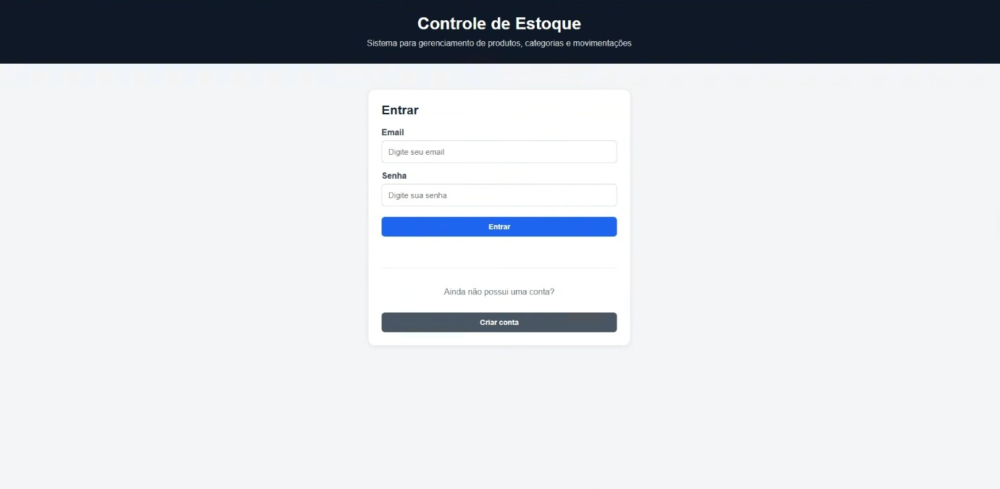
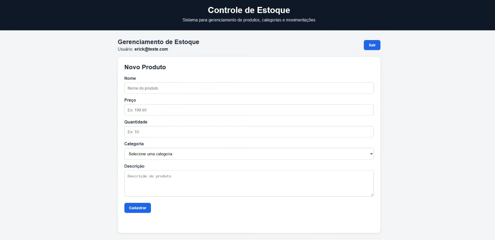
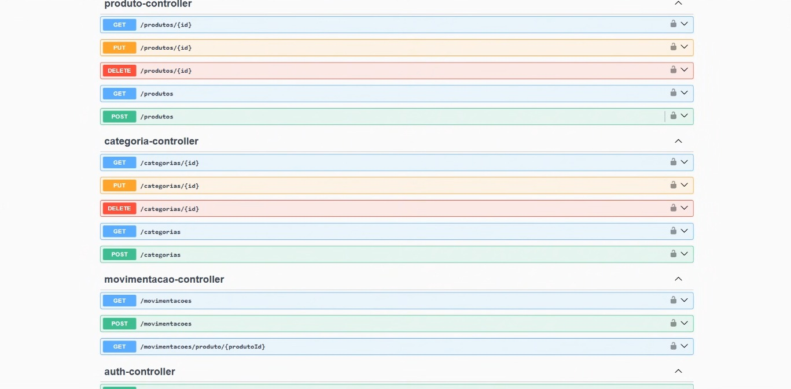
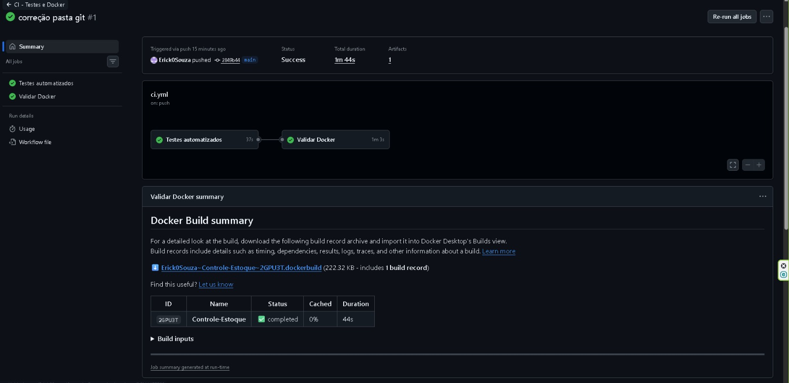

# Controle de Estoque

[](https://github.com/Erick0Souza/Controle-Estoque/actions/workflows/ci.yml)

Sistema web para gerenciamento de estoque desenvolvido com Java e Spring Boot.

O projeto permite cadastrar usuários, realizar autenticação com JWT, gerenciar produtos e categorias, registrar entradas e saídas de estoque e consultar o histórico de movimentações.

O projeto também possui testes automatizados, documentação da API com Swagger, PostgreSQL, Docker e integração contínua com GitHub Actions.

---

## Funcionalidades

- Cadastro de usuários
- Login com JWT
- Senhas protegidas com BCrypt
- Cadastro de produtos
- Edição de produtos
- Exclusão de produtos
- Listagem de produtos
- Associação de produtos a categorias
- Controle de quantidade em estoque
- Entrada de produtos
- Saída de produtos
- Validação de estoque insuficiente
- Histórico de movimentações
- Interface web integrada com a API
- Documentação da API com Swagger
- Testes automatizados
- Banco PostgreSQL
- Execução com Docker Compose
- Pipeline de CI com GitHub Actions

---

## Tecnologias utilizadas

### Back-end

- Java 17
- Spring Boot
- Spring Web
- Spring Data JPA
- Spring Security
- JWT
- BCrypt
- Bean Validation
- Maven

### Banco de dados

- PostgreSQL
- H2 para testes automatizados

### Front-end

- HTML
- CSS
- JavaScript
- Fetch API

### Testes

- JUnit
- Mockito
- MockMvc
- Spring Boot Test

### DevOps

- Docker
- Docker Compose
- GitHub Actions

### Documentação

- Swagger
- OpenAPI

---

## Arquitetura do projeto

```text
src
├── main
│   ├── java
│   │   └── com.erick.estoque
│   │       ├── categoria
│   │       ├── config
│   │       ├── exception
│   │       ├── movimentacao
│   │       ├── produto
│   │       ├── security
│   │       └── Application.java
│   │
│   └── resources
│       ├── static
│       │   ├── index.html
│       │   ├── app.js
│       │   └── style.css
│       │
│       └── application.yml
│
└── test
    ├── java
    └── resources
```

---

## Segurança

A aplicação utiliza autenticação baseada em JWT.

Após realizar o login, a API gera um token que deve ser enviado nas requisições protegidas através do cabeçalho:

```text
Authorization: Bearer SEU_TOKEN
```

As senhas dos usuários não são armazenadas diretamente no banco de dados.

Antes de serem salvas, elas são processadas utilizando BCrypt.

---

## Cadastro de usuário

É possível criar uma nova conta diretamente pela interface web ou através da API.

Endpoint:

```http
POST /auth/register
```

Exemplo:

```json
{
  "email": "usuario@teste.com",
  "senha": "123456"
}
```

---

## Login

Endpoint:

```http
POST /auth/login
```

Exemplo:

```json
{
  "email": "usuario@teste.com",
  "senha": "123456"
}
```

Resposta:

```json
{
  "token": "JWT_GERADO_PELA_API"
}
```

---

## Usuário de demonstração

Para facilitar os testes do projeto, a aplicação cria um usuário de demonstração.

```text
Email: avaliador@teste.com
Senha: 123456
```

Estas credenciais são destinadas apenas ao ambiente de demonstração.

---

## Principais endpoints

### Autenticação

```text
POST /auth/register
POST /auth/login
```

### Produtos

```text
GET    /produtos
GET    /produtos/{id}
POST   /produtos
PUT    /produtos/{id}
DELETE /produtos/{id}
```

### Categorias

```text
GET /categorias
```

### Movimentações

```text
POST /movimentacoes
GET  /movimentacoes
GET  /movimentacoes/produto/{produtoId}
```

---

# Executando o projeto

## Requisitos

Para executar utilizando Docker, é necessário possuir:

- Git
- Docker
- Docker Compose

---

## 1. Clone o projeto

```bash
git clone https://github.com/Erick0Souza/Controle-Estoque.git
```

Entre na pasta:

```bash
cd Controle-Estoque
```

---

## 2. Configure as variáveis de ambiente

O projeto possui o arquivo:

```text
.env.example
```

Você pode utilizá-lo como referência para criar:

```text
.env
```

Exemplo:

```env
POSTGRES_DB=estoque
POSTGRES_USER=postgres
POSTGRES_PASSWORD=troque_a_senha
APP_JWT_SECRET=coloque_aqui_uma_chave_jwt_com_pelo_menos_32_caracteres
PORT=8081
```

Não utilize senhas ou chaves reais no repositório.

---

## 3. Execute com Docker

```bash
docker compose up -d --build
```

Confira os containers:

```bash
docker compose ps
```

A API ficará disponível em:

```text
http://localhost:8081
```

---

## Interface web

Após iniciar o projeto, abra:

```text
http://localhost:8081
```

Pela interface é possível:

- criar uma conta;
- realizar login;
- visualizar produtos;
- cadastrar produtos;
- editar produtos;
- excluir produtos;
- registrar entradas;
- registrar saídas;
- acompanhar o histórico do estoque.

---

## Swagger

A documentação interativa da API pode ser acessada em:

```text
http://localhost:8081/swagger-ui/index.html
```

Após realizar o login e obter o JWT:

1. Clique em **Authorize**.
2. Informe o token.
3. Execute os endpoints protegidos.

---

## Executando os testes

Com Maven instalado:

```bash
mvn clean test
```

Também é possível executar utilizando Docker:

```powershell
docker run --rm -v "${PWD}:/app" -v maven-cache:/root/.m2 -w /app maven:3.9-eclipse-temurin-17 mvn test
```

Os testes utilizam H2, evitando a necessidade de utilizar o PostgreSQL durante a execução dos testes automatizados.

---

## Integração contínua

O projeto utiliza GitHub Actions.

A pipeline é executada automaticamente em pushes e pull requests para a branch `main`.

O processo executa:

```text
Push / Pull Request
        ↓
Testes automatizados
        ↓
Build da imagem Docker
        ↓
Pipeline concluída
```

Dessa forma, alterações que quebrem os testes ou impeçam a construção da imagem Docker podem ser identificadas automaticamente.

---

## Imagens do projeto

### Login e criação de conta



### Sistema de controle de estoque



### Swagger



### GitHub Actions


---

## Estrutura Docker

O ambiente utiliza dois serviços principais:

```text
Docker Compose
│
├── API
│   └── Spring Boot
│
└── Banco de dados
    └── PostgreSQL
```

A API aguarda o PostgreSQL ficar saudável antes da inicialização através do `healthcheck` configurado no Docker Compose.

---

## Tratamento de estoque

As movimentações são divididas em dois tipos:

```text
ENTRADA
SAIDA
```

Uma entrada aumenta a quantidade disponível do produto.

Uma saída reduz a quantidade disponível.

Caso a quantidade solicitada seja superior ao estoque disponível, a operação é rejeitada.

---

## Objetivo do projeto

Este projeto foi desenvolvido com o objetivo de praticar e demonstrar conhecimentos em desenvolvimento Full Stack, incluindo:

- criação de APIs REST;
- arquitetura em camadas;
- persistência de dados;
- autenticação;
- segurança;
- integração entre front-end e back-end;
- banco de dados relacional;
- testes automatizados;
- containers;
- integração contínua;
- documentação de APIs.

---

## Autor

**Erick Souza**