# Controle de Estoque

[](https://github.com/Erick0Souza/Controle-Estoque/actions/workflows/ci.yml)

Sistema web Full Stack para gerenciamento de estoque desenvolvido com **Java 17, Spring Boot, PostgreSQL, HTML, CSS e JavaScript**.

O sistema permite gerenciar produtos, categorias, usuários e movimentações de estoque, além de possuir autenticação JWT, controle de acesso por perfis, auditoria, dashboard administrativo, relatórios, exportações e testes automatizados.

O projeto foi desenvolvido com foco em organização, segurança, regras de negócio e práticas utilizadas em aplicações reais.

---

## Funcionalidades

- Cadastro e autenticação de usuários
- Login utilizando JWT
- Proteção de senhas com BCrypt
- Perfis de acesso `ADMIN`, `OPERADOR` e `CONSULTA`
- Controle de permissões por perfil
- Proteção contra excesso de tentativas de login
- Cadastro de produtos
- Edição de produtos
- Exclusão de produtos
- SKU único
- Imagem de produtos
- Estoque mínimo
- Alerta de estoque baixo
- Busca e filtros de produtos
- Ordenação
- Paginação
- Gerenciamento de categorias
- Entrada de produtos
- Saída de produtos
- Validação de estoque insuficiente
- Histórico de movimentações
- Registro do usuário responsável pelas movimentações
- Gerenciamento administrativo de usuários
- Alteração de perfil de usuário
- Redefinição de senha por administrador
- Auditoria de ações
- Dashboard administrativo
- Relatórios de estoque
- Relatórios de movimentações
- Exportação CSV
- Exportação XLSX
- Exportação PDF
- Backup do PostgreSQL
- Backup de uploads
- Recuperação de backups
- Interface web integrada com a API
- Swagger / OpenAPI
- Testes automatizados
- PostgreSQL
- H2 para testes
- Docker
- Docker Compose
- GitHub Actions

---

## Tecnologias utilizadas

### Back-end

- Java 17
- Spring Boot 3
- Spring Web
- Spring Data JPA
- Hibernate
- Spring Security
- JWT
- BCrypt
- Bean Validation
- Maven

### Banco de dados

- PostgreSQL
- H2 para testes automatizados

### Front-end

- HTML5
- CSS3
- JavaScript
- Fetch API

### Relatórios

- CSV
- Apache POI para arquivos XLSX
- Apache PDFBox para arquivos PDF

### Testes

- JUnit 5
- Mockito
- MockMvc
- Spring Boot Test
- H2

### DevOps

- Docker
- Docker Compose
- Git
- GitHub
- GitHub Actions

### Documentação

- Swagger
- OpenAPI

---

## Arquitetura do projeto

```text
src
├── main
│   ├── java
│   │   └── com.erick.estoque
│   │       ├── auditoria
│   │       ├── categoria
│   │       ├── config
│   │       ├── dashboard
│   │       ├── exception
│   │       ├── exportacao
│   │       ├── movimentacao
│   │       ├── produto
│   │       ├── relatorio
│   │       ├── security
│   │       └── Application.java
│   │
│   └── resources
│       ├── static
│       │   ├── index.html
│       │   ├── app.js
│       │   └── style.css
│       │
│       ├── application.yml
│       ├── application-dev.yml
│       └── application-prod.yml
│
└── test
    ├── java
    └── resources
        └── application-test.yml
```

A aplicação é dividida por domínio, facilitando manutenção e evolução do código.

---

# Segurança

A aplicação utiliza autenticação baseada em **JWT**.

Após o login, o token deve ser enviado através do cabeçalho:

```text
Authorization: Bearer SEU_TOKEN
```

O JWT possui expiração de aproximadamente:

```text
8 horas
```

A chave JWT não possui valor padrão no projeto.

Ela deve obrigatoriamente ser informada através da variável:

```text
APP_JWT_SECRET
```

A chave deve possuir pelo menos:

```text
32 bytes
```

---

## Proteção de senhas

As senhas nunca são armazenadas em texto puro.

Elas são processadas utilizando:

```text
BCrypt
```

Por limitação e segurança do BCrypt, as senhas aceitas pelo sistema devem possuir entre:

```text
8 e 72 bytes
```

---

## Proteção contra tentativas de login

O sistema possui proteção contra tentativas repetidas de autenticação.

Atualmente são utilizados limites para:

```text
Usuário + IP
IP
```

Após várias tentativas inválidas, o login pode retornar:

```http
429 Too Many Requests
```

Mensagem:

```text
Muitas tentativas de login. Tente novamente em alguns minutos
```

A implementação atual utiliza uma janela de aproximadamente 5 minutos.

---

## Proteção contra descoberta de usuários

Mesmo quando o email informado não existe, a aplicação realiza uma comparação BCrypt utilizando um hash fictício.

Isso reduz diferenças de tempo de resposta entre:

```text
usuário existente
usuário inexistente
```

O objetivo é dificultar técnicas de enumeração de usuários.

---

## Perfis de acesso

A aplicação possui três perfis.

### ADMIN

Possui acesso completo ao sistema.

Pode:

- gerenciar produtos;
- excluir produtos;
- gerenciar categorias;
- realizar movimentações;
- gerenciar usuários;
- alterar perfis;
- redefinir senhas;
- consultar auditoria;
- visualizar dashboard;
- utilizar relatórios;
- realizar exportações.

### OPERADOR

Pode realizar operações do dia a dia do estoque.

Pode:

- consultar produtos;
- cadastrar produtos;
- editar produtos;
- alterar imagens;
- consultar categorias;
- realizar entradas;
- realizar saídas;
- consultar movimentações.

Não possui acesso às rotas administrativas.

### CONSULTA

Perfil destinado à consulta.

Pode:

- visualizar produtos;
- visualizar categorias;
- consultar movimentações.

Não pode alterar dados do estoque.

---

# Ambientes da aplicação

O projeto possui perfis separados.

```text
dev
test
prod
```

O perfil ativo pode ser configurado através da variável:

```env
SPRING_PROFILES_ACTIVE=dev
```

---

## Ambiente DEV

No perfil:

```text
dev
```

o projeto utiliza:

- PostgreSQL;
- atualização automática do schema com Hibernate;
- Swagger habilitado;
- cadastro público de usuários habilitado.

---

## Ambiente TEST

Os testes utilizam:

```text
H2
```

Dessa forma, os testes automatizados não dependem do PostgreSQL instalado ou em execução.

---

## Ambiente PROD

O perfil:

```text
prod
```

possui configurações mais restritivas.

Entre elas:

- `ddl-auto=validate`;
- Swagger desabilitado;
- OpenAPI desabilitado;
- cadastro público desabilitado;
- mensagens internas de erro ocultadas;
- stack traces não retornados ao cliente;
- credenciais obrigatórias através de variáveis de ambiente.

---

# Cabeçalhos de segurança

A configuração do Spring Security inclui cabeçalhos adicionais de proteção.

Entre eles:

```text
X-Content-Type-Options
X-Frame-Options
Referrer-Policy
Content-Security-Policy
Permissions-Policy
Cache-Control
```

A aplicação também utiliza política de segurança de conteúdo para limitar recursos carregados pelo navegador.

---

# CORS

As origens permitidas são configuradas através de:

```env
CORS_ALLOWED_ORIGINS
```

Exemplo local:

```env
CORS_ALLOWED_ORIGINS=http://localhost:8081,http://127.0.0.1:8081
```

Assim, as origens podem ser alteradas sem modificar o código da aplicação.

---

# Cadastro de usuário

Endpoint:

```http
POST /auth/register
```

Exemplo:

```json
{
  "nomeUsuario": "Erick",
  "email": "usuario@teste.com",
  "senha": "Senha123"
}
```

Novos usuários recebem inicialmente o perfil:

```text
CONSULTA
```

No ambiente `prod`, o cadastro público é desabilitado por padrão.

---

# Login

Endpoint:

```http
POST /auth/login
```

Exemplo:

```json
{
  "email": "usuario@teste.com",
  "senha": "Senha123"
}
```

Exemplo de resposta:

```json
{
  "token": "JWT_GERADO_PELA_API",
  "nomeUsuario": "Erick",
  "email": "usuario@teste.com",
  "perfil": "CONSULTA"
}
```

---

# Usuário e dados de demonstração

O projeto atualmente possui um `DataInitializer` que cria dados iniciais para facilitar testes locais.

Ele pode criar:

- usuário administrador de demonstração;
- categorias;
- produtos iniciais.

> Antes de utilizar a aplicação em produção, o `DataInitializer` deve ser removido, desabilitado ou limitado somente ao perfil de desenvolvimento.

---

# Produtos

Principais endpoints:

```text
GET    /produtos
GET    /produtos/{id}
POST   /produtos
PUT    /produtos/{id}
DELETE /produtos/{id}
```

Também existem endpoints para imagens:

```text
POST   /produtos/{id}/imagem
DELETE /produtos/{id}/imagem
```

Cada produto pode possuir:

```text
SKU
Nome
Preço
Quantidade
Estoque mínimo
Categoria
Descrição
Imagem
```

---

## Filtros de produtos

A listagem suporta filtros como:

```text
nome
sku
categoriaId
precoMin
precoMax
quantidadeMin
quantidadeMax
```

Também são suportados:

```text
page
size
sort
direction
```

---

## Estoque baixo

Um produto é considerado com estoque baixo quando:

```text
quantidade <= estoque mínimo
```

---

# Categorias

Principais endpoints:

```text
GET    /categorias
POST   /categorias
PUT    /categorias/{id}
DELETE /categorias/{id}
```

Alterações de categorias são restritas ao perfil:

```text
ADMIN
```

---

# Movimentações

Endpoints:

```text
POST /movimentacoes
GET  /movimentacoes
GET  /movimentacoes/produto/{produtoId}
```

Existem dois tipos:

```text
ENTRADA
SAIDA
```

Uma entrada aumenta o estoque.

Uma saída reduz o estoque.

Caso seja solicitada uma quantidade maior do que a disponível, a operação é bloqueada.

---

# Administração de usuários

Endpoints administrativos:

```text
GET /admin/usuarios
GET /admin/usuarios/{id}

PUT /admin/usuarios/{id}/perfil
PUT /admin/usuarios/{id}/senha
```

O sistema possui regras adicionais, como:

- impedir que o sistema fique sem administrador;
- impedir que um administrador remova o próprio perfil administrativo;
- criptografar novas senhas utilizando BCrypt;
- registrar alterações na auditoria.

---

# Auditoria

Endpoints:

```text
GET /admin/auditorias
GET /admin/auditorias/{id}
```

Algumas ações registradas:

```text
PRODUTO_CRIADO
PRODUTO_EDITADO
PRODUTO_EXCLUIDO

IMAGEM_PRODUTO_ADICIONADA
IMAGEM_PRODUTO_REMOVIDA

MOVIMENTACAO_ENTRADA
MOVIMENTACAO_SAIDA

PERFIL_USUARIO_ALTERADO
SENHA_USUARIO_REDEFINIDA
```

Os registros podem armazenar:

```text
Data e hora
Usuário
Email
Perfil
Ação
Entidade
ID da entidade
Descrição
```

A auditoria suporta filtros, paginação e ordenação.

---

# Dashboard

Endpoint:

```text
GET /admin/dashboard
```

O dashboard apresenta indicadores como:

- total de produtos;
- total de categorias;
- total de usuários;
- total de movimentações;
- total de entradas;
- total de saídas;
- produtos com estoque baixo;
- quantidade total de unidades;
- valor total do estoque;
- atividades recentes.

---

# Relatórios

## Relatório de estoque

```text
GET /admin/relatorios/estoque
```

É possível filtrar somente produtos com estoque baixo:

```text
GET /admin/relatorios/estoque?somenteEstoqueBaixo=true
```

O relatório apresenta informações como:

```text
SKU
Produto
Categoria
Preço
Quantidade
Estoque mínimo
Status
Valor em estoque
```

---

## Relatório de movimentações

```text
GET /admin/relatorios/movimentacoes
```

Filtros disponíveis:

```text
dataInicio
dataFim
tipo
```

Exemplo:

```text
GET /admin/relatorios/movimentacoes?tipo=ENTRADA
```

---

# Exportações

## CSV

```text
GET /admin/exportacoes/estoque/csv
GET /admin/exportacoes/movimentacoes/csv
```

## Excel

```text
GET /admin/exportacoes/estoque/xlsx
GET /admin/exportacoes/movimentacoes/xlsx
```

## PDF

```text
GET /admin/exportacoes/estoque/pdf
GET /admin/exportacoes/movimentacoes/pdf
```

As exportações de movimentações aceitam filtros por período e tipo.

---

# Backup e recuperação

O projeto possui scripts para backup e restauração.

Entre eles:

```text
scripts/
├── backup-database.ps1
├── backup-uploads.ps1
├── backup-completo.ps1
├── restore-database.ps1
├── restore-uploads.ps1
└── restore-completo.ps1
```

Os backups podem incluir:

```text
PostgreSQL
Uploads de imagens
```

---

# Executando o projeto

## Requisitos

Para executar com Docker:

- Git
- Docker
- Docker Compose

---

## 1. Clone o projeto

```bash
git clone https://github.com/Erick0Souza/Controle-Estoque.git
```

Entre na pasta:

```bash
cd Controle-Estoque
```

---

## 2. Configure as variáveis de ambiente

O projeto possui:

```text
.env.example
```

Crie:

```text
.env
```

Exemplo atualizado:

```env
SPRING_PROFILES_ACTIVE=dev

POSTGRES_DB=estoque
POSTGRES_USER=postgres
POSTGRES_PASSWORD=troque-esta-senha

APP_JWT_SECRET=gere-uma-chave-segura-com-pelo-menos-32-bytes

CORS_ALLOWED_ORIGINS=http://localhost:8081,http://127.0.0.1:8081

PORT=8081
```

> Nunca envie o arquivo `.env`, senhas reais ou chaves JWT reais para o GitHub.

---

## 3. Execute com Docker

```bash
docker compose up -d --build
```

Confira os containers:

```bash
docker compose ps
```

A aplicação ficará disponível em:

```text
http://localhost:8081
```

Para finalizar:

```bash
docker compose down
```

---

# Interface web

Após iniciar o projeto, abra:

```text
http://localhost:8081
```

A interface web permite utilizar as principais funcionalidades sem depender do Swagger.

Entre elas:

- login;
- cadastro;
- produtos;
- categorias;
- imagens;
- movimentações;
- histórico;
- usuários;
- auditoria;
- dashboard;
- relatórios;
- exportações.

As funcionalidades disponíveis mudam de acordo com o perfil autenticado.

---

# Swagger

No ambiente de desenvolvimento:

```text
http://localhost:8081/swagger-ui/index.html
```

Após realizar o login:

1. copie o JWT;
2. clique em **Authorize**;
3. informe o token;
4. execute os endpoints protegidos.

No perfil:

```text
prod
```

o Swagger e a documentação OpenAPI ficam desabilitados.

---

# Upload de arquivos

A aplicação possui limite de upload configurado.

```text
Arquivo máximo: 5 MB
Requisição máxima: 6 MB
```

---

# Testes automatizados

Execute:

```bash
mvn clean test
```

A suíte atual possui:

```text
113 testes
Failures: 0
Errors: 0
```

Os testes cobrem módulos como:

- autenticação;
- segurança;
- permissões;
- categorias;
- produtos;
- filtros;
- paginação;
- movimentações;
- usuários;
- auditoria;
- dashboard;
- relatórios;
- exportações;
- regras de negócio;
- integração.

Os testes utilizam o banco em memória:

```text
H2
```

---

# Build

Para gerar o `.jar`:

```bash
mvn clean package
```

O arquivo será criado dentro de:

```text
target/
```

A versão atual foi validada com:

```text
BUILD SUCCESS
```

---

# Integração contínua

O projeto utiliza:

```text
GitHub Actions
```

A pipeline é executada automaticamente em:

```text
push na main
pull request para main
execução manual
```

O fluxo atual é:

```text
Push / Pull Request
        ↓
Configuração Java 17
        ↓
mvn clean test
        ↓
Testes automatizados
        ↓
Build da imagem Docker
        ↓
Validação concluída
```

O job de Docker utiliza:

```text
Docker Buildx
```

e valida se a imagem da aplicação consegue ser construída corretamente.

---

# Estrutura Docker

```text
Docker Compose
│
├── API
│   └── Spring Boot
│
└── Banco de dados
    └── PostgreSQL
```

A API recebe informações do banco e configurações através de variáveis de ambiente.

A variável JWT é obrigatória também na execução por Docker.

---

# Tratamento de erros

A aplicação possui tratamento global de exceções.

Entre os casos tratados estão:

```text
Validação de dados
JSON inválido
Parâmetros ausentes
Tipos inválidos
Upload acima do limite
Conflito de dados
Erros internos
```

As respostas seguem um formato padronizado contendo informações como:

```json
{
  "status": 400,
  "mensagem": "Descrição do erro",
  "timestamp": "..."
}
```

No ambiente de produção, informações internas e stack traces não são expostos ao usuário.

---

# Imagens do projeto

As telas abaixo apresentam algumas das principais funcionalidades disponíveis na aplicação.

## Login e criação de conta

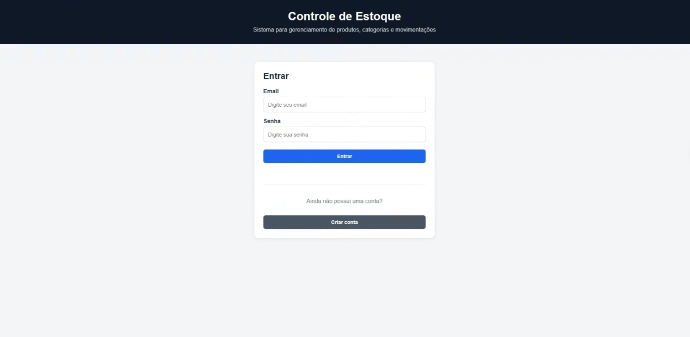

Autenticação de usuários e acesso ao sistema através de JWT.

---

## Dashboard administrativo

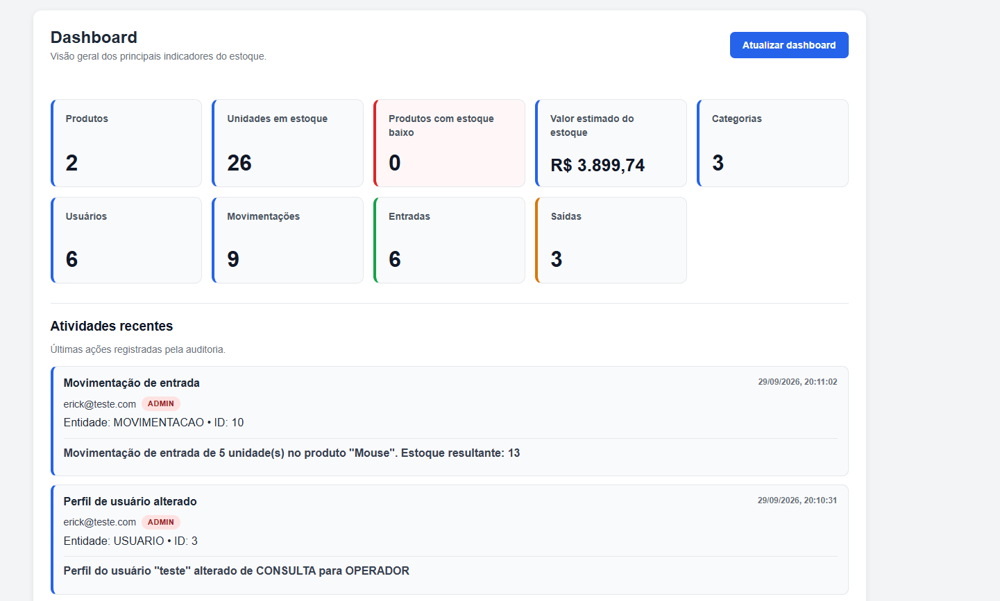

Visão geral do estoque com indicadores de produtos, unidades, estoque baixo, valor total, usuários, movimentações e atividades recentes.

---

## Gerenciamento de produtos

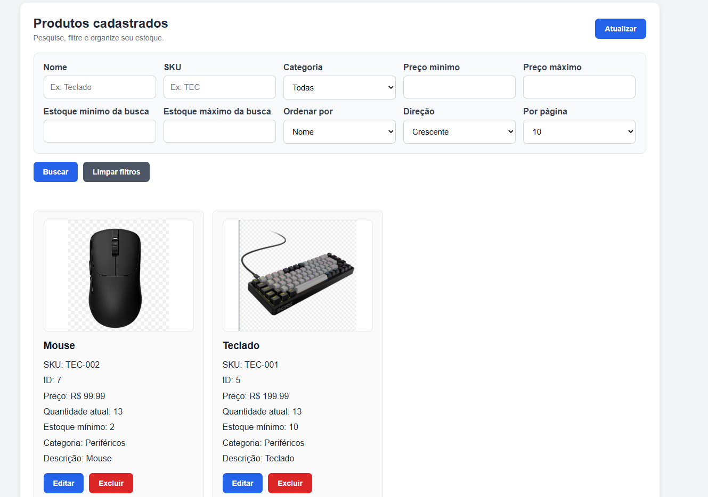

Listagem de produtos com SKU, categoria, preço, quantidade, estoque mínimo, filtros, paginação e gerenciamento de imagens.

---

## Movimentações de estoque

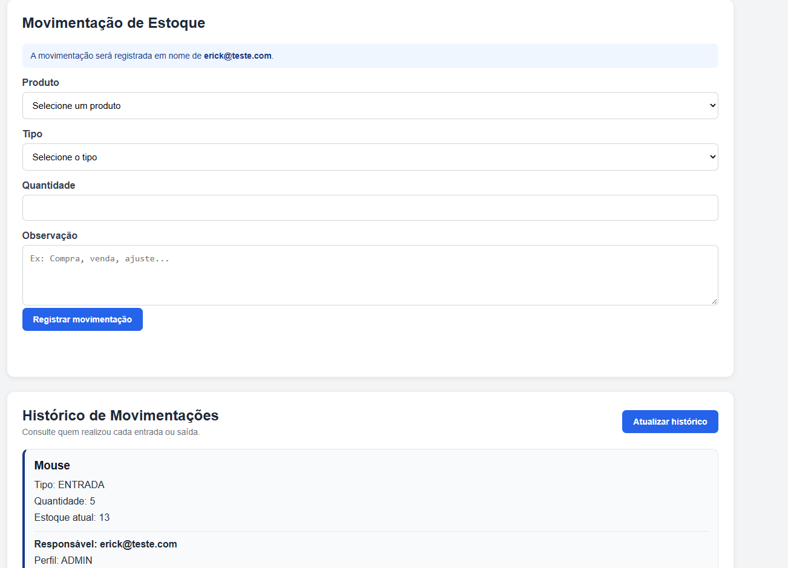

Registro de entradas e saídas e acompanhamento do histórico de movimentações.

---

## Gerenciamento de usuários

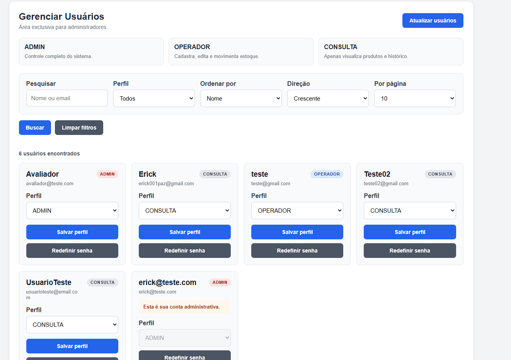

Área administrativa para consulta de usuários, alteração de perfis e gerenciamento de contas.

---

## Auditoria

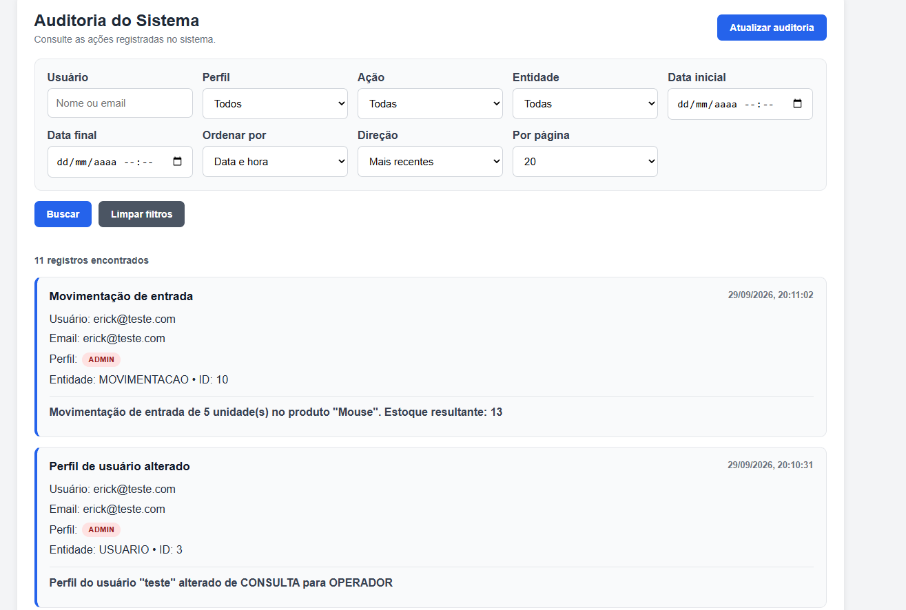

Histórico das principais ações realizadas no sistema, com filtros, usuários responsáveis e data das operações.

---

## Relatórios e exportações

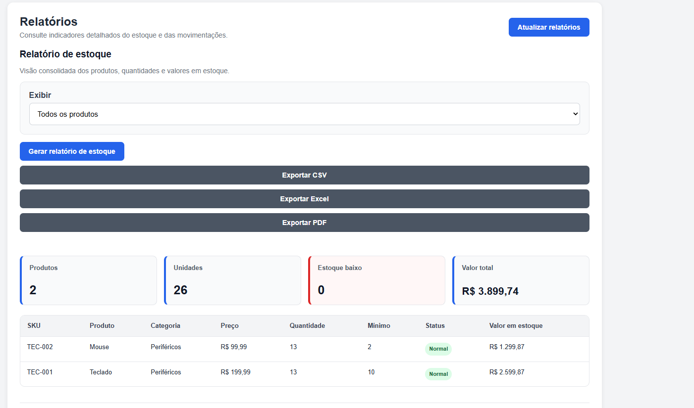

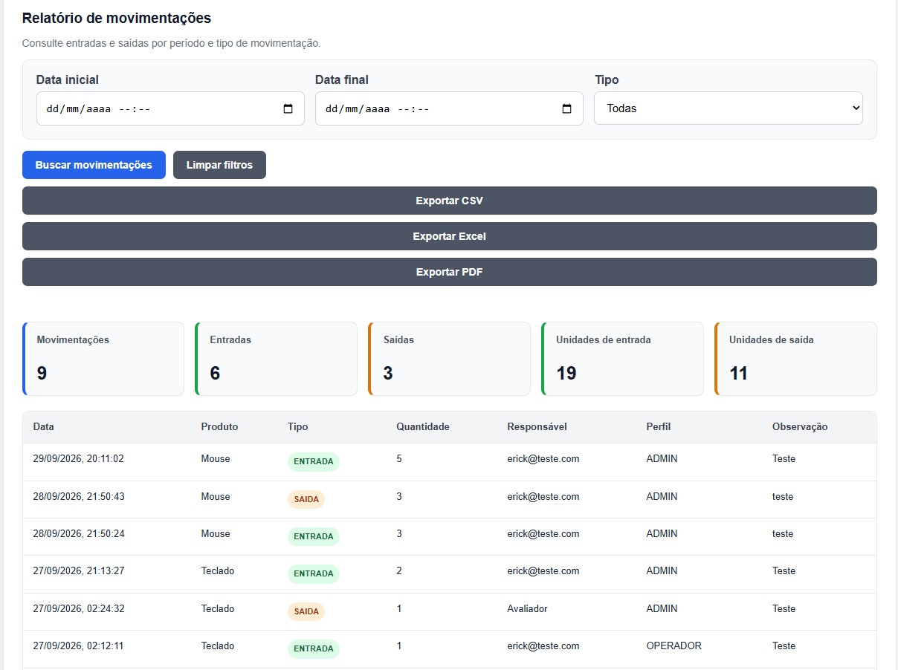

Relatórios de estoque e movimentações com filtros e opções de exportação em CSV, XLSX e PDF.

---

## Interface geral

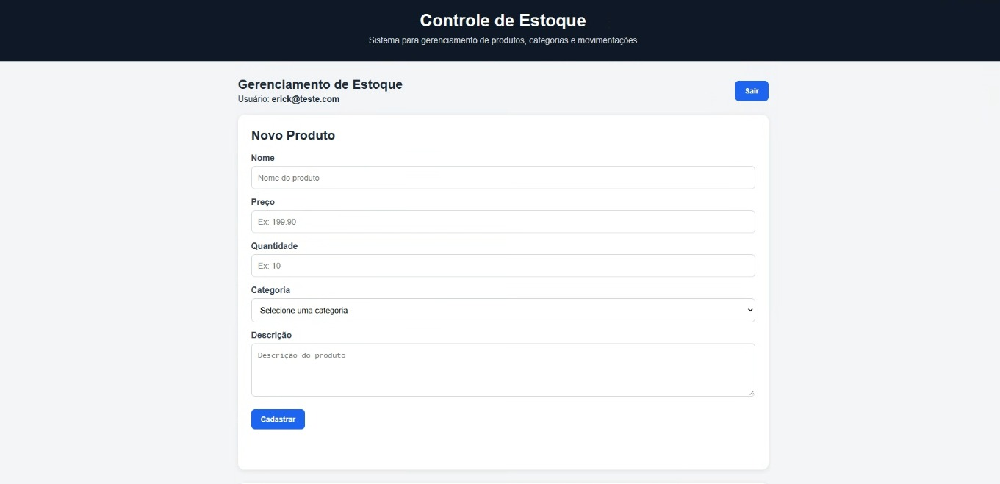

Interface web integrada diretamente com a API Spring Boot.

---

## Swagger / OpenAPI

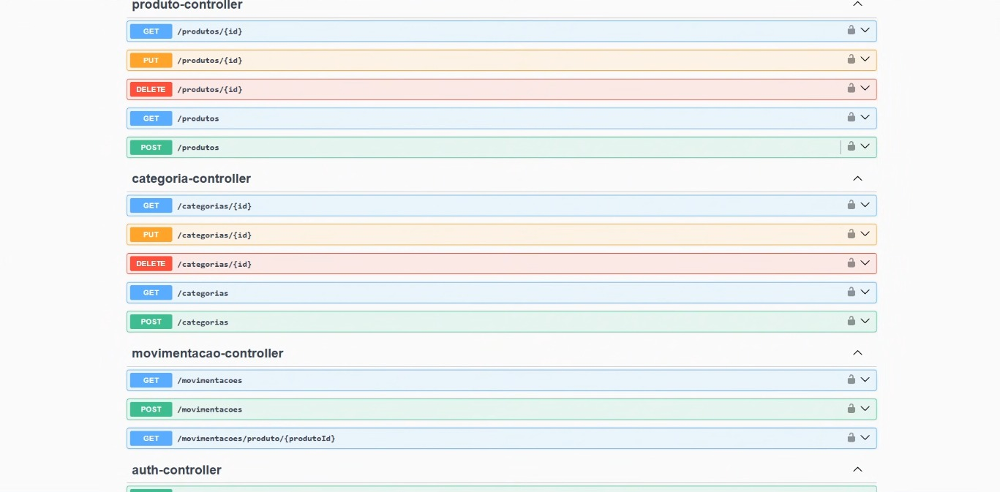

Documentação interativa utilizada para consulta e teste dos endpoints durante o desenvolvimento.

---

## Integração contínua

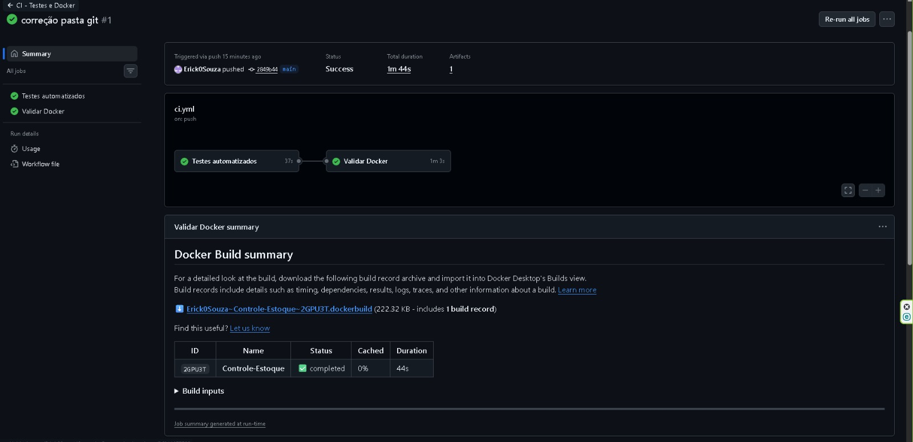

Pipeline automatizada responsável pela execução dos testes e validação da imagem Docker.
```
---

# Objetivo do projeto

Este projeto foi desenvolvido para praticar e demonstrar conhecimentos em desenvolvimento Full Stack, incluindo:

- desenvolvimento de APIs REST;
- Java;
- Spring Boot;
- Spring Security;
- autenticação JWT;
- controle de acesso;
- segurança;
- persistência com JPA/Hibernate;
- PostgreSQL;
- validação de dados;
- tratamento de erros;
- integração front-end e back-end;
- regras de negócio;
- testes automatizados;
- geração de relatórios;
- exportação de arquivos;
- containers;
- integração contínua;
- backup e recuperação;
- organização de ambientes;
- documentação de APIs.

---

# Status do projeto

```text
Back-end                     ✅
Front-end                    ✅
PostgreSQL                   ✅
Autenticação JWT             ✅
Proteção BCrypt              ✅
Proteção de login            ✅
Perfis e permissões          ✅
Produtos                     ✅
Categorias                   ✅
Movimentações                ✅
Imagens                      ✅
Estoque mínimo               ✅
Filtros e paginação          ✅
Usuários administrativos     ✅
Auditoria                    ✅
Dashboard                    ✅
Relatórios                   ✅
CSV / XLSX / PDF             ✅
Backup e recuperação         ✅
Testes automatizados         ✅
Docker                       ✅
GitHub Actions               ✅
Perfis dev/test/prod         ✅
Segurança de produção        ✅
```

---

# Observação sobre produção

A aplicação já possui configurações específicas para produção, porém o deploy em nuvem ainda não foi realizado.

Antes de publicar em produção, é recomendado:

```text
Desabilitar dados de demonstração
Utilizar credenciais próprias
Gerar uma nova APP_JWT_SECRET forte
Configurar CORS_ALLOWED_ORIGINS
Configurar PostgreSQL de produção
Ativar SPRING_PROFILES_ACTIVE=prod
Executar backup inicial
```

---

# Repositório

```text
https://github.com/Erick0Souza/Controle-Estoque
```

---

# Autor

**Erick Souza**
